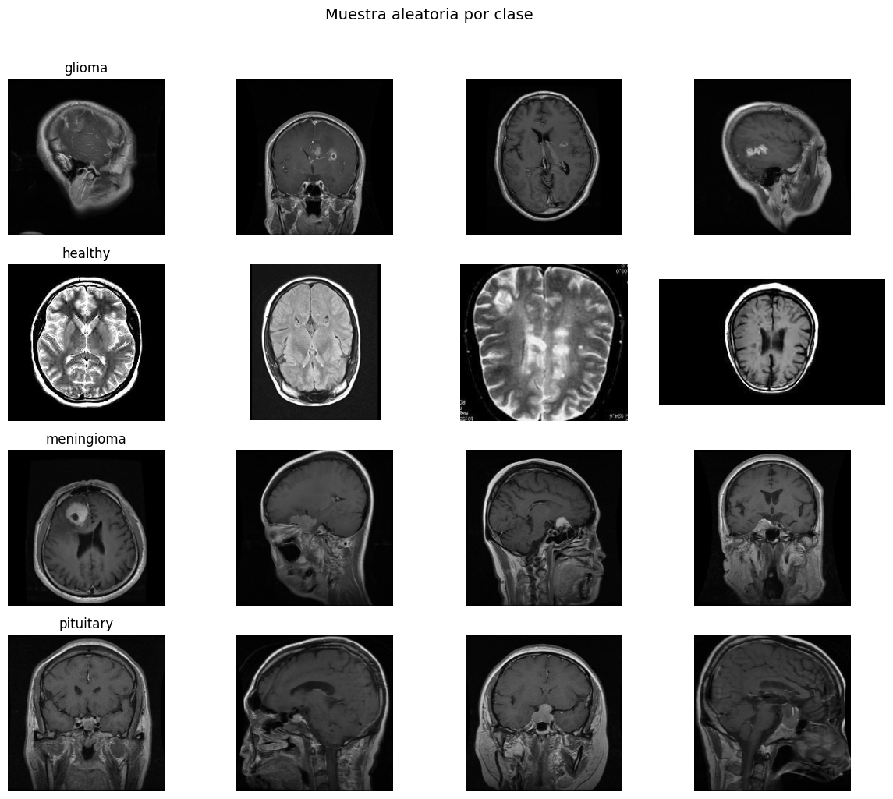
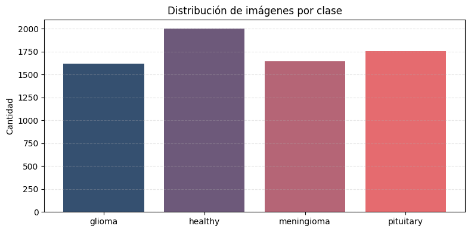
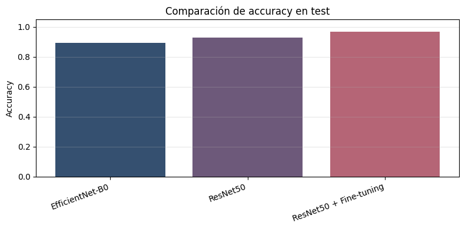
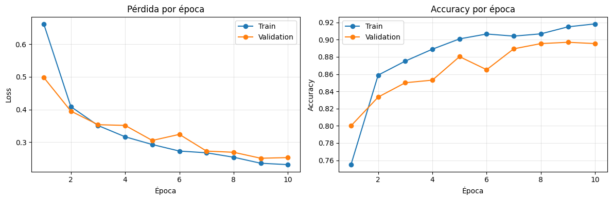
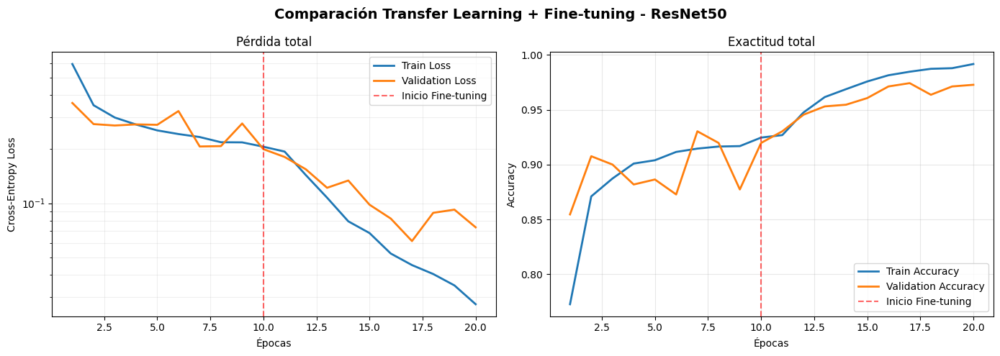
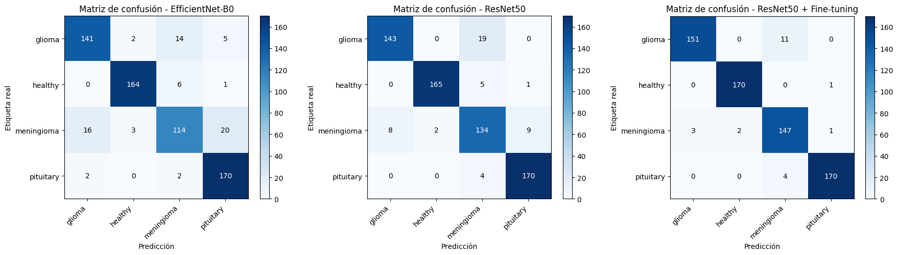
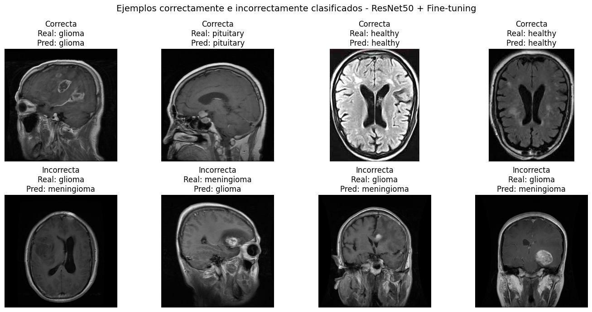

# Brain MRI Classification with Transfer Learning: EfficientNet-B0 and ResNet50

This repository contains the implementation, experimentation, and comparative quantitative and qualitative analysis of Deep Learning models based on Transfer Learning and Fine-Tuning for multiclass classification of brain Magnetic Resonance Imaging (MRI) scans. The project evaluates and benchmarks EfficientNet-B0 and ResNet50 on the Brain Tumor MRI Scans dataset, adapting representations pretrained on ImageNet to the clinical domain.

Authors: Sergio Pardo, Jefferson Moreno, John Pino  
Master's in Artificial Intelligence — Deep Learning Techniques

---

## Table of Contents

1. [Introduction and Clinical Context](#introduction-and-clinical-context)
2. [Dataset and Data Pipeline](#dataset-and-data-pipeline)
3. [Model Architectures and Transfer Learning Strategy](#model-architectures-and-transfer-learning-strategy)
4. [Training Configuration and Protocol](#training-configuration-and-protocol)
5. [Quantitative Results](#quantitative-results)
6. [Qualitative Analysis and Learning Curves](#qualitative-analysis-and-learning-curves)
7. [Confusion Matrices and Diagnostic Breakdown](#confusion-matrices-and-diagnostic-breakdown)
8. [Discussion and Limitations](#discussion-and-limitations)
9. [Project Structure](#project-structure)
10. [Installation and Usage Guide](#installation-and-usage-guide)
11. [References](#references)

---

## Introduction and Clinical Context

Automated classification of intracranial neoplasms using Magnetic Resonance Imaging (MRI) is a critical assistive technology in modern radiology and clinical oncology. Manual examination of brain scans is labor-intensive, subject to inter-observer variability, and demands high clinical expertise. Furthermore, automated models face challenges including acquisition artifacts, signal-to-noise variations, and patient anatomical heterogeneity.

The objective of this research is to evaluate the trade-off between computational cost, feature discriminability, and generalization capacity using 2D axial MRI slices. Three experimental configurations are compared:

1. **EfficientNet-B0:** A compound scaling architecture with ~5.3 million parameters, prioritizing computational efficiency.
2. **ResNet50 (Transfer Learning):** A 25-million-parameter deep residual network with a frozen feature extractor, leveraging generic low- and mid-level visual features.
3. **ResNet50 + Fine-Tuning:** Unfreezing the top convolutional blocks (`conv5_x`) to specialize high-level abstract filters to the distinct morphologies, boundaries, and textures of intracranial lesions.

---

## Dataset and Data Pipeline

The project utilizes the public **Brain Tumor (MRI Scans)** benchmark dataset, consisting of 7,023 axial slices categorized into four diagnostic classes:

- `glioma`: Glial cell tumors exhibiting infiltrative growth patterns and ill-defined margins.
- `healthy`: Normal control scans without pathological or neoplastic findings.
- `meningioma`: Extra-axial meningeal tumors typically presenting uniform, well-circumscribed enhancement.
- `pituitary`: Sellar and parasellar adenomas located in the pituitary fossa.



### Data Cleaning and Preprocessing Pipeline

- **File Validation:** Automated filtering to discard corrupted files, system artifacts, and unsupported extensions, restricting valid inputs to `.jpg`, `.jpeg`, and `.png`.
- **Exact Duplicate Deduplication:** Elimination of duplicate images through cryptographic MD5 hashing of raw file contents.
- **Spatial Resizing and Normalization:** Uniform bilinear resizing to 224x224 pixels with 3 RGB channels, followed by normalization calibrated to ImageNet statistics.
- **Stratified Partitioning:** Splitting into 80% training, 10% validation, and 10% independent test sets (random seed 42), strictly preserving class proportions across splits.
- **Data Augmentation:** Applied exclusively during training to enhance generalization while maintaining anatomical validity (random horizontal flips, rotations up to +/- 15 degrees, and controlled contrast adjustments).



---

## Model Architectures and Transfer Learning Strategy

Both model families were adapted for 4-class classification using classification heads with Softmax activation.

```
End-to-End Processing Architecture:
Input (224x224x3) -> Augmentation (Train only) -> ImageNet Preprocessing -> Pretrained Backbone -> GlobalAveragePooling2D -> Dropout(0.2) -> Dense(4, Softmax)
```

### 1. EfficientNet-B0
- **Total Parameters:** ~5.3M.
- **Strategy:** Frozen convolutional feature extractor; training is restricted to the final dense classification layer (1,280 -> 4), resulting in ~5,124 trainable parameters.

### 2. ResNet50 (Transfer Learning)
- **Total Parameters:** ~25M.
- **Strategy:** Frozen backbone; `GlobalAveragePooling2D` layer followed by `Dropout(0.2)` and a 4-unit `Dense(Softmax)` head.

### 3. ResNet50 with Fine-Tuning
- **Strategy:** Initialized from the best checkpoint obtained in the Transfer Learning stage, followed by unfreezing all convolutional layers in the `conv5_x` block.
- **Batch Normalization Stability:** All `BatchNormalization` layers remain strictly frozen (`trainable = False`) to prevent distortion of moving mean and variance statistics learned on ImageNet.

---

## Training Configuration and Protocol

All models were evaluated under uniform training conditions to guarantee experimental fairness:

- **Optimizer:** Adam.
- **Loss Function:** Sparse Categorical Cross-Entropy.
- **Batch Size:** 32.
- **Learning Rate Schedule:**
  - Transfer Learning stage: 1e-3.
  - Fine-Tuning stage: 1e-5 (two orders of magnitude reduction to mitigate catastrophic forgetting of pretrained weights).
- **Epochs:** 10 epochs per phase.
- **Model Selection Criterion:** Continuous monitoring of validation loss (`val_loss`), chosen over `val_accuracy` due to its ability to penalize overconfident incorrect predictions.
- **Hardware Acceleration:** GPU / Apple Silicon (MPS) acceleration using `tf.data.AUTOTUNE` for multi-threaded parallel prefetching.

---

## Quantitative Results

Final evaluation was performed on the independent test split (10% of total data, 703 images), which remained entirely untouched throughout training and hyperparameter optimization.

### Table I. Overall Performance Comparison on Independent Test Set

| Model Architecture | Test Loss | Test Accuracy | Macro F1-Score | Trainable Parameters |
|:---|:---:|:---:|:---:|:---:|
| EfficientNet-B0 | 0.2885 | 89.24% | 0.8878 | ~5 K |
| ResNet50 (TL) | 0.2049 | 92.73% | 0.9253 | ~8 K |
| **ResNet50 + Fine-Tuning** | **0.1172** | **96.67%** | **0.9657** | **~15 M** |

ResNet50 with Fine-Tuning outperformed EfficientNet-B0 by **7.43 percentage points** and base ResNet50 Transfer Learning by **3.94 percentage points**, achieving a test loss of 0.1172.



### Table II. Class-Level Performance Breakdown (F1-Score)

| Pathological Class | EfficientNet-B0 | ResNet50 (TL) | ResNet50 + Fine-Tuning | Best Performing Configuration |
|:---|:---:|:---:|:---:|:---:|
| `glioma` | 0.8393 | 0.9185 | **0.9657** | ResNet50 + FT |
| `healthy` | 0.9647 | 0.9600 | **0.9730** | ResNet50 + FT |
| `meningioma` | 0.7889 | 0.8508 | **0.9333** | ResNet50 + FT |
| `pituitary` | 0.9189 | 0.9720 | **0.9908** | ResNet50 + FT |

---

## Qualitative Analysis and Learning Curves

### Learning Curves: EfficientNet-B0

EfficientNet-B0 shows smooth convergence; however, due to its compact parameterization and frozen feature extractor, validation accuracy plateaus near 89%, indicating relative underfitting on domain-specific medical textures.



### Learning Curves: ResNet50 (Transfer Learning and Fine-Tuning)

The complete two-phase training trajectory of ResNet50 demonstrates the impact of layered adaptation. During initial epochs (frozen extractor), loss decreases steadily. Upon activating fine-tuning at epoch 10 with a reduced learning rate of 1e-5, cross-entropy loss experiences a sharp further reduction without numerical instability.



---

## Confusion Matrices and Diagnostic Breakdown

The distribution of test set errors reveals that diagnostic ambiguity is primarily concentrated between classes with overlapping morphological characteristics.



*From left to right: Test confusion matrices for EfficientNet-B0, ResNet50, and ResNet50 + Fine-Tuning.*

### Table III. Detailed Diagnostic Matrix Breakdown by Class and Architecture

| Model | Class | True Positives (TP) | True Negatives (TN) | False Negatives (FN) | False Positives (FP) |
|:---|:---|:---:|:---:|:---:|:---:|
| **EfficientNet-B0** | Glioma | 141 | 480 | 21 | 18 |
| | Healthy | 164 | 484 | 7 | 5 |
| | Meningioma | 114 | 485 | 39 | 22 |
| | Pituitary | 170 | 460 | 4 | 26 |
| **ResNet50 (TL)** | Glioma | 143 | 490 | 19 | 8 |
| | Healthy | 165 | 487 | 6 | 2 |
| | Meningioma | 134 | 479 | 19 | 28 |
| | Pituitary | 170 | 476 | 4 | 10 |
| **ResNet50 + FT** | **Glioma** | **151** | **495** | **11** | **3** |
| | **Healthy** | **170** | **487** | **1** | **2** |
| | **Meningioma** | **147** | **492** | **6** | **15** |
| | **Pituitary** | **170** | **484** | **4** | **2** |

### Visual Inspection of Predictions: Successes and Failure Cases

Qualitative review indicates that false negatives in meningioma largely occur when tumors abut brain parenchyma without marked hyperintensity, leading to confusion with low-grade gliomas. Fine-tuning allows the network to learn subtle boundary features and dural attachment cues, reducing false negatives from 39 down to 6.



---

## Discussion and Limitations

1. **Representational Capacity vs. Parameter Efficiency:** ResNet50 exhibits superior feature representation compared to EfficientNet-B0 on complex brain slice textures. Fine-tuning the `conv5_x` block is crucial for tailoring generic ImageNet filters to intracranial lesions.
2. **Clinical Significance of False Negative Reduction:** In diagnostic settings, false negatives in tumor detection pose the greatest clinical risk. ResNet50 + FT raised meningioma recall from 0.7451 to 0.9608, substantially improving diagnostic safety.
3. **Overfitting Containment:** While the final training and validation accuracies showed a gap (99.17% vs. 97.27%), checkpoint selection based on minimum validation loss at epoch 7 effectively prevented generalization decay.
4. **Methodological Limitation:** The dataset split was performed at the slice level rather than the patient level due to lack of subject metadata in the public benchmark, which is an inherent limitation when assessing out-of-distribution clinical generalization.

---

## Project Structure

```
brain-mri-efficientnet-resnet/
├── README.md                          # Technical project documentation
├── LICENSE                            # MIT License
├── requirements.txt                   # Reproducible Python dependencies
├── main.py                            # Command-line interface entry point
├── src/                               # Modular source code
│   ├── __init__.py                    # Package initializer
│   ├── config.py                      # Centralized paths, seeds, and hyperparameters
│   ├── data.py                        # MD5 deduplication, stratified splits, tf.data pipeline
│   ├── models.py                      # Architectures for EfficientNet-B0 and ResNet50
│   ├── train.py                       # Training routines and checkpoint callbacks
│   └── evaluate.py                    # Evaluation metrics, confusion matrices, reporting
├── notebooks/                         # Interactive exploratory notebooks
│   └── brain_mri_classification.ipynb # End-to-end reproducible Jupyter Notebook
├── figures/                           # High-resolution experiment figures and plots
│   ├── 01_dataset_distribution.png
│   ├── 02_mri_samples.png
│   ├── 03_efficientnet_learning_curves.png
│   ├── 04_resnet50_learning_curves.png
│   ├── 05_resnet50_ft_learning_curves.png
│   ├── 06_resnet50_vs_ft_combined.png
│   ├── 07_efficientnet_metrics_bar.png
│   ├── 08_efficientnet_confusion_matrix.png
│   ├── 09_efficientnet_qualitative.png
│   ├── 10_resnet50_metrics_bar.png
│   ├── 11_resnet50_confusion_matrix.png
│   ├── 12_resnet50_qualitative.png
│   ├── 13_resnet50_ft_metrics_bar.png
│   ├── 14_resnet50_ft_confusion_matrix.png
│   ├── 15_resnet50_ft_qualitative.png
│   ├── 16_models_accuracy_comparison.png
│   └── composite_confusion_matrices.png
└── docs/                              # Reports and experimental documentation
    ├── informe_final_microproyecto1.md
    └── cnn_mri_pytorch_reference.md
```

---

## Installation and Usage Guide

### 1. Clone the Repository

```bash
git clone https://github.com/JeffersonMoreno-137/brain-mri-efficientnet-resnet.git
cd brain-mri-efficientnet-resnet
```

### 2. Set Up Virtual Environment

```bash
python3 -m venv venv
source venv/bin/activate
```

### 3. Install Dependencies

```bash
pip install --upgrade pip
pip install -r requirements.txt
```

### 4. Dataset Placement

Download the Kaggle dataset (*Brain Tumor (MRI Scans)* by Rajarshi Mandal) and place it under the `dataset/` root directory:

```
dataset/
├── glioma/
├── healthy/
├── meningioma/
└── pituitary/
```

### 5. Running Training and Evaluation

Train and evaluate all models:

```bash
python main.py --model all
```

Run ResNet50 with Fine-Tuning only:

```bash
python main.py --model resnet50 --fine-tune
```

Run interactively via Jupyter Notebook:

```bash
jupyter notebook notebooks/brain_mri_classification.ipynb
```

---

## References

1. Tan, M., & Le, Q. V. (2019). *EfficientNet: Rethinking Model Scaling for Convolutional Neural Networks*. International Conference on Machine Learning (ICML). https://arxiv.org/abs/1905.11946
2. He, K., Zhang, X., Ren, S., & Sun, J. (2016). *Deep Residual Learning for Image Recognition*. IEEE Conference on Computer Vision and Pattern Recognition (CVPR). https://arxiv.org/abs/1512.03385
3. Mandal, R. (2023). *Brain Tumor (MRI Scans) Dataset*. Kaggle. https://www.kaggle.com/datasets/rm1000/braintumor-mri-scans
